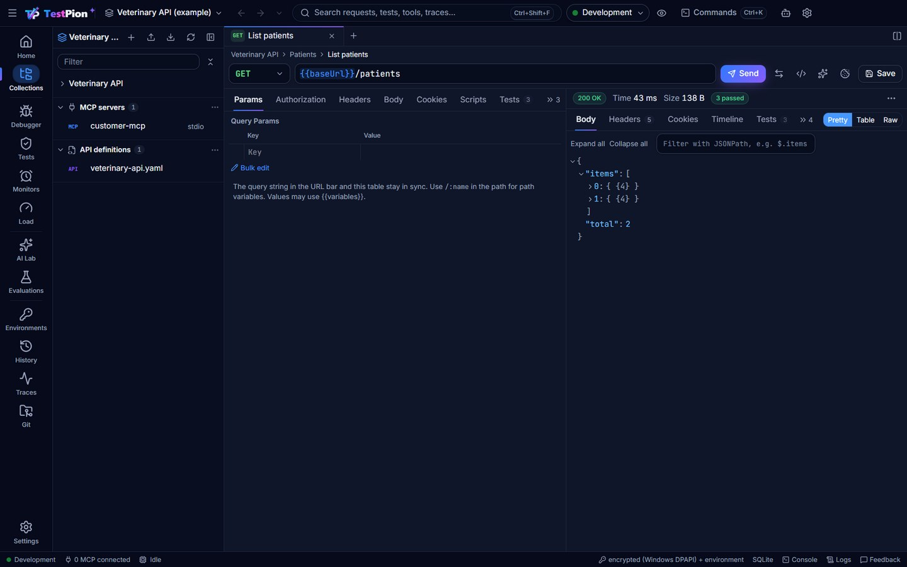

<p align="center"></p>

# TestPion

**A local-first desktop app and CLI for testing, debugging and evaluating REST, GraphQL and WebSocket APIs, MCP servers, LLM APIs, RAG pipelines and AI agents.**

TestPion brings together an API client, a GraphQL playground, an MCP inspector, an LLM playground and evaluation lab, a scalable test runner and a trace viewer. All of them run on one execution engine, which the `testpion` CLI also uses in CI.

**Website and docs:** https://nasimuddin-dev.github.io/testpion/ · **Download:** [Windows, macOS, Linux](https://nasimuddin-dev.github.io/testpion/download)



## Features

- **REST / HTTP.** Any method; JSON, XML, text, HTML, form, multipart and binary bodies; a per-workspace cookie jar with a Cookies manager (encrypted, never in workspace files); API key, Basic, Bearer, JWT, OAuth 2.0 (client credentials, password, auth code with PKCE) and mTLS. Large responses stream to disk while a virtualised viewer shows the preview. Responses include a timeline (DNS lookup, TCP connect, TLS handshake, waiting and download, with the server's certificate and days left), sandboxed pre-request and test scripts, and SSE streaming.
- **GraphQL.** Introspection, a schema explorer, and a Monaco editor with schema-aware autocomplete, validation and formatting. Scripts, GraphQL-specific assertions, subscriptions over WebSocket (`graphql-transport-ws` and `graphql-ws`), an operation builder from the schema, and code snippets.
- **gRPC.** `.proto` files or server reflection, unary and streaming methods, metadata, TLS and deadlines; copy a call as `grpcurl` or paste one in; load-test a method.
- **MCP.** stdio, Streamable HTTP and SSE transports. Discovery of tools, resources, templates and prompts, with the server's argument completions and resource subscriptions. Forms generated from each tool's JSON Schema, elicitation, sampling and roots answered in the inspector and in tests, save-as-test, mock servers, a full JSON-RPC protocol trace with latency, and a Usage tab with calls, failures and time per tool.
- **WebSocket, Socket.IO and MQTT.** Connect, send, emit or publish, subscribe to MQTT topics, inspect messages (with a traffic summary and a messages-per-second sparkline), and keep saved messages per connection.
- **Postman compatible.** Collections (v2.0 and v2.1) and environments import with their scripts. Scripts written for Postman (`pm.*`) also run unchanged: `tp.*` (with top-level `await`, `tp.require` script packages and `tp.vault`), cheerio, lodash, moment, tv4, `xml2Json` and ~75 dynamic variables (`{{$randomFirstName}}` …) work; `testpion run-collection` accepts Newman's command lines.
- **OpenAPI both ways.** Import (with contract checks and response examples, mockable at once), generate a document from a collection, and catch breaking changes between versions (`testpion openapi-diff`, also as a pull-request check in generated CI pipelines).
- **Record, mock, secure.** Record traffic through a local reverse proxy into a collection; mock servers with fresh fake data and forwarding to the real API; a security review of collections and a security-headers check.
- **AI / LLM.** OpenAI-compatible, Azure OpenAI, Anthropic, Gemini, Amazon Bedrock (Converse API, SigV4 or a Bedrock API key), Ollama and an offline mock provider. Prompt templates, structured-output validation, streaming with time-to-first-token, token and cost tracking (prices are configurable and versioned), side-by-side model comparison, a Usage tab with tokens and estimated cost per model, and rate limits with backoff.
- **AI help.** Describe a request in plain words, generate `tp.test` checks for a response, explain failed responses, slow requests (where the time went) and flaky tests (always labelled, never run automatically).
- **For AI agents.** `testpion mcp-server` lets Claude and other agents browse your collections, send requests, run collections, import definitions, diff OpenAPI versions, review security, find and rename variables and load-test local APIs over MCP, with secrets redacted and production environments protected. The CLI commands that return results have `--json`, and the docs site publishes `llms.txt`.
- **Evaluation.** Deterministic, heuristic, embedding and LLM-as-judge evaluators, with AI-judge results always labelled. RAG metrics, agent tool-use checks and safety checks (prompt injection, data leakage, tool misuse). Streamed datasets (JSONL, CSV, JSON, Markdown, URL, or a read-only SQLite query) and regression baselines; compare any two runs.
- **Test runner.** YAML suites with parallel workers, backpressure, retries, timeouts, dependencies, setup/teardown, cancellation and resumable runs; save any request as a test, re-run only the failures, or watch files and re-run. JUnit, JSON, HTML (with a response-time histogram and evaluator scores) and Markdown reports.
- **Load testing.** One endpoint, a gRPC method or a whole collection (each virtual user runs its requests in order, with its own cookies and an optional warm-up for tokens). Virtual users, ramp-up/down and RPS caps, reporting p50–p99 (per request for collections), error rate and status distribution, the server time (TTFB) and new vs reused connections, plus AI metrics (tokens/s, TTFT, cost). Pass/fail thresholds (`p95<500`, `errors<1%`) for CI, live charts with a shared crosshair, and a history of earlier runs with p95 and throughput trends. Safeguards block production and remote hosts by default.
- **Dashboards and charts.** A Home activity dashboard (requests, failures, median response and tests per day; shareable as one HTML file, or `testpion workspace-report`), a Charts tab on every run (including where the requests' time went), a runs overview, each test's history across runs (flaky tests stand out), monitor availability, uptime by day and run-time charts with response-time limits, a collection Overview with request health and variable flow, and a Table / Chart view of JSON responses that saves rows as datasets. Charts work with the keyboard.
- **Certificates.** Every HTTPS response records its host's certificate: Home lists those that expire first, monitors can fail before one expires, a `certificate` check works in any test, and `testpion certificates --warn 21` (or `--check host`) does it from CI.
- **Observability.** An OpenTelemetry trace for every execution (HTTP requests include their DNS, TCP, TLS, wait and download phases), with a waterfall viewer and export to any OTLP collector (Jaeger, Tempo, Honeycomb …), and a Postman-style console (Ctrl+Alt+C) with every request and its script output, redacted.
- **Workspace.** Collections with inherited auth, Postman-compatible `tp.*` scripts (including `tp.sendRequest` and the `tp.visualizer` response Visualizer) and saved response examples, local mock servers that serve those examples, Markdown documentation for requests and collections (with export), a Collection Runner (iterations, CSV/JSON data files or a SQLite query, workspace datasets, delay, `setNextRequest`), environments with precedence (Global → Workspace → Environment → Collection → Request → Runtime) and a quick look, a Home view, history grouped by day, global search and a command palette (Ctrl/Cmd+K). Import from OpenAPI, Postman, Insomnia, Bruno (collection folders, both ways), Hoppscotch, WSDL 1.1 and 2.0 (SOAP) or HAR, or paste a request copied from browser devtools (cURL, fetch or PowerShell) or an HTTPie command; export collections and environments to Postman v2.1, OpenAPI or Bruno.
- **Security and privacy.** Secrets are stored in the OS credential store (DPAPI, Keychain or Secret Service) and never in workspace files. Redaction covers logs, traces, reports and exports. Scripts run in a QuickJS/WASM sandbox. Telemetry is not implemented.

## Installation

Download the installer for your system from the [download page](https://nasimuddin-dev.github.io/testpion/download) or the [latest GitHub release](https://github.com/nasimuddin-dev/testpion/releases/latest):

| System | Files |
| --- | --- |
| Windows 10/11 x64 | `TestPion-<version>-windows-x64-setup.exe` (installer) or `-portable.exe` |
| macOS 12+ | `TestPion-<version>-macos-arm64.dmg` (Apple Silicon) or `-macos-x64.dmg` (Intel) |
| Linux x86_64 | `.AppImage`, `.deb` or `.rpm` |

The installers aren't code-signed yet; the [installation guides](https://nasimuddin-dev.github.io/testpion/installation/windows) explain the first-launch prompts.

### From source

```bash
git clone https://github.com/nasimuddin-dev/testpion.git
cd testpion
npm install
npm run build
npm run dev                      # desktop app (Electron)
npm run package -w @testpion/desktop  # installers for your OS in apps/desktop/release/
npm link -w @testpion/cli             # `testpion` CLI
```

Requires Node.js 22.13+ (Node 24+ recommended) to build.

## Quick start

The app opens a **TestPion Examples** workspace on first launch: REST, GraphQL, gRPC, WebSocket, SSE, MCP and AI examples against free public APIs, ready to send and run ([what's inside](https://nasimuddin-dev.github.io/testpion/getting-started/examples)). The same workspace works from the CLI:

```bash
testpion run -w examples/public-workspace --suite all       # public APIs (needs internet)
testpion run -w examples/public-workspace --suite offline   # offline demo model and MCP mock
```

For a fully local setup, the veterinary example runs against demo servers in this repository:

```bash
node examples/servers/demo-servers.mjs           # local REST, GraphQL, mock LLM and WebSocket servers
testpion run -w examples/veterinary-workspace --suite regression
```

This runs 22 tests covering REST, GraphQL, MCP, LLM, RAG, agent and safety checks, and writes reports to `examples/veterinary-workspace/runs/<runId>/`.

### REST example

```yaml
name: List patients
type: http
method: GET
url: "{{baseUrl}}/patients"
auth: { type: bearer, token: "{{accessToken}}" }
assertions:
  - { type: status, expected: 200 }
  - { type: exists, path: $.items[0].id }
  - { type: latency, max: 500 }
```

### GraphQL example

```yaml
name: Get Patient
type: graphql
endpoint: "{{graphqlEndpoint}}"
query: |
  query GetPatient($id: ID!) { patient(id: $id) { id name species } }
variables: { id: "123" }
assertions:
  - { type: graphql-no-errors }
  - { type: exists, path: $.data.patient.id }
```

### MCP example

```yaml
name: Search Customer MCP Tool
type: mcp
server: customer-mcp
tool: search_customer
arguments: { customer_id: "123" }
assertions:
  - { type: status, expected: success }
  - { type: equals, path: $.customer.id, expected: "123" }
```

### AI evaluation example

```yaml
name: Intent dataset
type: llm
model: { provider: openai, name: my-model, temperature: 0 }
prompt: 'Classify as JSON {"intent": "..."}: {{message}}'
responseFormat: { type: json }
dataset: { path: ../../datasets/intents.jsonl }
evaluators:
  - { type: exact-match, path: $.intent, expected: "{{expected}}" }
  - { type: llm-judge, judge: { provider: openai, name: judge-model }, criteria: "The intent is correct", threshold: 0.7 }
```

### CI

```bash
testpion test ./tests -e Staging -r console junit html -o results
# run a collection like Newman, including Postman collection/environment files and CSV data
testpion run-collection api.postman_collection.json -e staging.postman_environment.json -d data.csv
# keep cookies between runs (a Newman cookie jar file works too)
testpion run-collection api.postman_collection.json --cookie-jar cookies.json --export-cookie-jar cookies.json
# exit codes: 0 success · 1 test failure · 2 configuration error · 3 execution error
```

## Architecture

```text
apps/desktop   Electron + React + Monaco (sandboxed renderer, IPC RPC bridge)
packages/cli   testpion CLI
packages/core  the single execution engine: protocol adapters, AI providers, agent loop,
               variables, sandboxed scripts, checks/evaluators, tracer, streaming runner,
               reports, load testing, storage (files + SQLite + secret stores), importers
docs/          Markdown documentation (VitePress → GitHub Pages)
examples/      demo servers, the veterinary workspace (local) and the public examples workspace
tests/         unit, integration and end-to-end tests
scripts/       benchmark
```

See [docs/architecture/overview.md](docs/architecture/overview.md).

## Documentation

Read it at **https://nasimuddin-dev.github.io/testpion/**. The Markdown sources live in [`docs/`](docs/index.md); build the site with `npm run docs:build`. `.github/workflows/docs.yml` publishes it to GitHub Pages.

## Releasing

Bump `version` in `package.json` and `apps/desktop/package.json`, add a `CHANGELOG.md` section, then push a matching tag (for example `v0.1.1`). `.github/workflows/release.yml` builds the Windows, macOS and Linux installers and publishes them to a GitHub Release with `SHA256SUMS.txt`. Regenerate the website screenshots with `npm run screenshots -w @testpion/desktop`.

## Roadmap

- gRPC, MQTT and Kafka adapters; GraphQL subscriptions over graphql-ws
- Mock HTTP, GraphQL and MCP servers in the app (a mock LLM provider already exists)
- A native AWS Bedrock provider (SigV4)
- Database-query datasets
- Optional cloud execution, team workspaces and scheduling (SRS Phase 9)

## Contributing

See [CONTRIBUTING.md](CONTRIBUTING.md). To report a security issue, see [SECURITY.md](SECURITY.md).

## License

[MIT](LICENSE)
